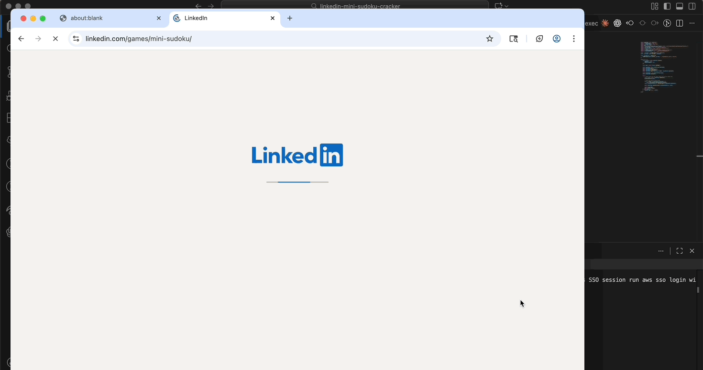

# linkedin mini sudoku cracker

uses answer set programming (ASP) language to solve linkedin's mini sudoku and then uses puppeteer to automate the process of inputing the solved solution into linkedin via the browser.



## installing

install clingo (to run answer set programming logic programs):

**macOS**
```bash
brew install clingo
```

**Ubuntu/Debian**
```bash
sudo apt install gringo clasp
```

**Windows**
```bash
pip install clingo
```

**Cross-platform (conda)**
```bash
conda install -c conda-forge clingo
```

install node module dependencies (puppeteer)
```bash
npm i
```

## setup

create a `loginDetails.json` file in the project root with your linkedin credentials:

```json
{
    "email": "your-email@example.com",
    "password": "your-password"
}
```

## running

```
node src/index.js
```

the app will open a browser, log into linkedin, navigate to the mini sudoku game, read the puzzle clues automatically, solve it, and input the solution.

### options

**--wait-until \<time\>**

delay inputting the solution until the puzzle timer reaches a specific time (format: `M:SS`):

```
node src/index.js --wait-until 2:05
node src/index.js --wait-until=2:05
```

this waits until the timer shows 2 minutes and 5 seconds before entering the solution.
